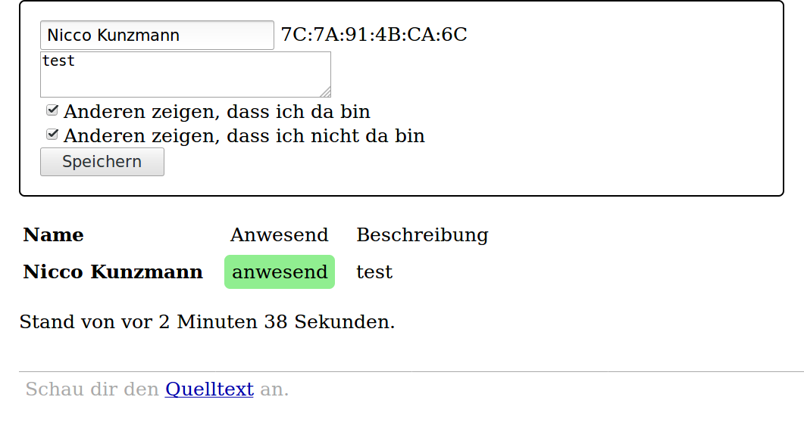

Wer Ist Da?
===========



Personen können anderen mitteilen, dass sie gerade im Netzwerk sind.

Das ist ein HTTP-Server, der zeigt, wer gerade im Netzwerk ist.
Man muss selbst erst eine Freigabe dafür einrichten, dass
man gefunden werden möchte.
Dann wird angezeigt, ob man da ist.

Installation
------------

Zur Entwicklung und Ausführung:

(1) Klonen des Repos

```
git clone https://github.com/Chaostreff-Potsdam/wer-ist-da.git
cd wer-ist-da
```

(2) Python installieren

```
sudo apt-get install virtualenv python3
virtualenv -p python3 ENV
source ENV/bin/activate
pip install -r requirements.txt
```

Ausführen
---------

```
./app.py
```

In Ordner [service](service) steht, wie der Server als Dienst ausgeführt werden
kann.

